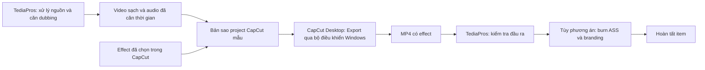

# TASK-20260930-CAPCUT-RESEARCH: Khả năng nối TediaPros với CapCut để dùng effect và render

- **Trạng thái:** Hoàn thành khảo sát; chưa triển khai hoặc kiểm chứng tích hợp live.
- **Người thực hiện:** Codex.
- **Thời gian:** 2026-09-30, Asia/Saigon.

---

## 1. Mục Tiêu (Goal)

Xác định cách TediaPros có thể chuyển dữ liệu AutoShort sang CapCut, dùng tài nguyên hiệu ứng của CapCut và nhận video đã render. Phân biệt khả năng được tài liệu mô tả, bằng chứng mã nguồn/local và phần chưa thử với tài khoản/renderer thật.

Yêu cầu đã làm rõ: tận dụng tài khoản CapCut Pro đang dùng trên máy; tự động render rồi trả MP4 về TediaPros; bản đầu dùng effect từ project mẫu. Cập nhật 2026-10-01: input là một thư mục video và một template draft, output là một thư mục video hoàn chỉnh; không chiếm chuột, bàn phím hoặc quyền điều khiển desktop đang dùng. Người dùng yêu cầu chỉ khảo sát và đưa phương hướng, chưa triển khai.

Kết luận đề xuất: ưu tiên project mẫu + CapCut Desktop thật + bộ điều khiển Export trên Windows. Có các hướng qua MCP/cloud và SDK nhưng chưa chứng minh chúng sử dụng quyền Pro của phiên Desktop hoặc tự export mọi effect. Tạo draft và render MP4 là hai năng lực phải kiểm chứng riêng.

---

## 2. Tiêu Chuẩn Nghiệm Thu (Acceptance Criteria)

- [x] Kiểm tra điểm nối trong pipeline hiện tại và tài nguyên trung gian đã có.
- [x] Kiểm tra nguồn chính thức cùng công cụ cộng đồng; không đồng nhất MCP, SDK, draft writer và renderer.
- [x] Đề xuất hướng triển khai phù hợp và nêu các điểm cần thử thật.
- [x] Mở rộng so sánh các cách tổ chức pipeline, điều khiển Desktop, dịch vụ cloud và renderer thay thế theo yêu cầu mới; ghi rõ các phương án có thể kết hợp.
- [x] Typecheck thành công: `npm.cmd run typecheck`, exit code 0.
- [x] Test liên quan: không áp dụng vì không thay đổi mã thực thi; không coi typecheck là bằng chứng tích hợp CapCut.
- [x] Lập bản bàn giao theo `.ai/tasks/TASK_TEMPLATE.md`.

---

## 3. Phạm Vi Triển Khai (Scope & Boundaries)

- **Thuộc phạm vi:** đọc mã/tài liệu TediaPros; tra cứu nguồn trên web; đọc tài liệu và manifest trong gói plugin công khai; kiểm tra metadata executable và cấu trúc draft local; mở CapCut và thử đọc trạng thái cửa sổ trong bước khảo sát trước khi người dùng giới hạn lại phạm vi; đề xuất các phương án.
- **Ngoài phạm vi:** cài plugin hoặc thư viện; OAuth; tải video người dùng lên dịch vụ; chỉnh draft hiện có; thử render; thay đổi pipeline hoặc IPC. Sau chỉ dẫn chỉ khảo sát, không tiếp tục điều khiển ứng dụng hoặc triển khai tính năng.
- Workspace ban đầu sạch trên branch `SonVersion`. Chỉ thêm bản khảo sát này.

---

## 4. Quyết Định Kiến Trúc & Lý Do (Decisions & Rationale)

### A. Điểm nối trong TediaPros — CODE_CONFIRMED tại thời điểm khảo sát 2026-09-30

- `src/main/autoShortItemCoordinator.ts:1695`: nối audio TTS theo timeline; tạo `timed.srt`, lưu artifact `tts-timeline.wav` và timeline manifest.
- `src/main/autoShortItemCoordinator.ts:1830`: áp dụng dubbing time map cho video và OCR mask trước render.
- `src/main/autoShortItemCoordinator.ts:1861`: truyền video, SRT, audio, mask, overlay và videoEffects cho `deps.burn`; cung cấp đường dẫn FFmpeg/FFprobe và expected-media contract.
- `src/main/burn.ts:1752`: đường render AutoShort hiện tại thuộc hệ thống FFmpeg của TediaPros.
- `docs/autoshort-video-effects.md`: ba effect hiện tại là nhiễu hạt, bụi phim, nhiễu analog, tự sinh bằng FFmpeg. Chưa tích hợp tài nguyên/preset CapCut.
- Tìm kiếm `capcut|jianying|draft_content` trong `src`, `docs`, `package.json` và kiểm tra thêm package-lock/preload/shared types không tìm thấy adapter thực thi CapCut hiện hữu. Tên branch lịch sử có chữ CapCut không chứng minh có tính năng này.

Điểm nối đề xuất là sau khi hoàn tất xử lý nguồn, dubbing và retime, trước bước burn cuối. Đây là đề xuất thiết kế, chưa được cài vào mã nguồn.

### B. MCP chính thức — DOCUMENT_CONFIRMED, CHƯA LIVE

[CapCut × Codex](https://www.capcut.com/tools/capcut-x-codex) công bố workflow chính thức cho footage và draft có thể chỉnh sửa. Đã đọc thêm [tài liệu bootstrap](https://sf16-sg.tiktokcdn.com/obj/eden-sg/962370eh7nupenuhbo/capcut_codex_plugin/SKILL.md) và [gói plugin công khai](https://sf16-sg.tiktokcdn.com/obj/eden-sg/962370eh7nupenuhbo/capcut_codex_plugin/plugins_v20.zip) bằng HTTPS, chỉ kiểm tra tĩnh trong bộ nhớ.

Manifest của gói ghi phiên bản `0.2.0`, license `UNLICENSED` và hai MCP endpoint:

- Account-bound: `https://www.capcut.com/api/external_mcp`.
- Resource/presentation: `https://www.capcut.com/api/external_mcp/resource`.

Các khả năng mô tả trong gói:

- `video-editing/references/materials.md`: `search_capcut_material` tìm music, sound_effect, font, text_template, video_effect, filter, transition, text_effect và face_effect; nhận resource metadata cùng `stdraft_uri` để áp vào draft.
- Music, sound effect và video effect dùng prompt tìm kiếm. Font, hiệu ứng chữ, template chữ, face effect, transition và filter trả danh sách curated với thứ tự cố định; không suy ra quyền truy cập toàn bộ kho CapCut.
- `capcut-stdraft-builder`: chức năng local cho video/image/audio/caption, effect/filter và transition trên STDraft. Effect/filter có khoảng thời gian và track riêng; transition đòi hai clip liền nhau trên cùng layer.
- `web-collaborative-editing`: tạo session, kiểm tra version, đọc/push snapshot, trả liên kết editor cloud. Media mới cần upload lấy VID/URI; đường dẫn local không tự được chuyển thành media trên cloud.
- AI rough cut có thể trả thẻ video đã dựng và draft liên quan. Sau post-edit, tài liệu phân biệt rõ local validation, cloud save và xuất video mới. Không dùng preview trước chỉnh sửa làm bằng chứng render các effect vừa thêm.

Khả năng dùng một MCP client từ TediaPros là hướng có cơ sở kỹ thuật, nhưng phải xác minh OAuth cho client riêng, quyền tích hợp, tool schema/export hiện được cấp và kết quả thật. Gói plugin công bố cho Codex không tự chứng minh đây là SDK được phép chép/nhúng vào ứng dụng bên thứ ba. Không sao chép mã plugin vào repo trong khảo sát này.

Session hiện không có tool CapCut callable; tìm `CapCut` trong Plugin Management trả danh sách rỗng. Kết quả này chỉ phản ánh danh mục của công cụ ở session này, không phủ nhận plugin công bố qua marketplace riêng của CapCut.

### C. Draft CapCut Desktop — PHƯƠNG ÁN ĐỀ XUẤT BAN ĐẦU

[capcut-cli](https://github.com/renezander030/capcut-cli) là công cụ cộng đồng viết draft local; có API JavaScript phù hợp Electron/Node. Tài liệu có `replace-media` để thay source giữ timing/effect/keyframe, cùng import subtitle, template và đồng bộ timeline. Lệnh `render` tạo proxy bằng FFmpeg, không chạy renderer CapCut và không chứng minh render đúng effect gốc.

[pyCapCut](https://github.com/GuanYixuan/pyCapCut) là lựa chọn Python để tạo draft/effect/filter/transition. Tài liệu hiện ghi module batch export đang chuyển đổi, không đủ để cam kết tự động export trên CapCut 9.2. [pyJianYingDraft](https://github.com/GuanYixuan/pyJianYingDraft) là dự án riêng cho JianYing; khả năng export của bản đó không tự áp dụng cho CapCut International.

[Ma trận tương thích capcut-cli](https://github.com/renezander030/capcut-cli/blob/master/docs/version-support.md) vẫn xếp các build CapCut 9.x khác vào expected-compatible/unverified. Một số build mới dùng timeline lồng làm nguồn chính; không dựa vào sửa root JSON duy nhất. Tài liệu có trường hợp template cũ bị app từ chối và khuyến khích dùng project do đúng build đang cài tạo ra. Tính tương thích phải đo trên build mục tiêu.

Quy trình đề xuất:

1. Tạo project mẫu trong chính CapCut đang cài, đặt các effect/transition/text style mong muốn và tải tài nguyên bằng tài khoản sử dụng thực tế.
2. TediaPros xuất gói media bền vững: video đã xử lý nguồn/retime, audio đã căn thời gian, SRT cuối và manifest.
3. Tạo draft mới từ mẫu; thay media/caption, giữ liên kết effect và các trường schema cần thiết, điều chỉnh khoảng thời gian effect theo video mới.
4. Mở draft trong CapCut để kiểm tra, rồi export bằng renderer CapCut. Chỉ đánh dấu video hoàn tất khi có MP4 mới và kiểm tra decode, duration, audio/subtitle alignment.

Nếu cần subtitle/text có thể chỉnh sửa trong CapCut, không burn phụ đề đích vào media nền. OCR cleanup, STTN và timing vẫn có thể chạy trong TediaPros. Không chuyển đường dẫn scratch làm source của draft lâu dài; cần copy asset sang package trước khi lifecycle dọn file. Chuẩn hóa cut/retime phải giữ mapping đồng nhất với audio/SRT và tempo hiện hành.

Theo mục tiêu mới, tự động mở/export bằng UI automation là một phần bắt buộc của phương án Desktop. Nó phụ thuộc build, UI, trạng thái đăng nhập, tải tài nguyên và export dialog; chưa có export acceptance trong task này. Không coi đây là headless render API chính thức.

### D. BytePlus SDK — LỰA CHỌN CHÍNH THỨC CHO ỨNG DỤNG RIÊNG

[BytePlus Video Editor overview](https://docs.byteplus.com/th/docs/byteplus-video-editor-sdk/docs-product-overview) mô tả công nghệ editor/export/effect dùng trong các app ByteDance, gồm CapCut; tài liệu này hiện có nhãn Archive.

[BytePlus Effects FAQ](https://docs.byteplus.com/en/docs/effects/docs-faq-sdks) nêu hỗ trợ Windows/macOS. [Hướng dẫn tích hợp với Electron](https://docs.byteplus.com/en/docs/byteplus-rtc/docs-114717) mô tả thư viện native, resource và license riêng, trong ngữ cảnh RTC/video capture. Đây là bằng chứng cho khả năng tích hợp Effects vào Electron, chưa phải bằng chứng cho full file-render pipeline của AutoShort.

Phải xác nhận gói effect được cấp, license, nền tảng và khả năng xử lý/export file. Không suy ra license SDK chia sẻ với thuê bao CapCut Pro hoặc toàn bộ catalog CapCut consumer.

### E. Điều kiện tài nguyên

Tài nguyên Pro vẫn phụ thuộc quyền tài khoản khi export: [CapCut giải thích yêu cầu Pro khi xuất](https://www.capcut.com/help/join-capcut-pro-for-exporting). [Hướng dẫn template theo nền tảng](https://www.capcut.com/help/use-and-export-templates-in-capcut) cũng giới hạn trải nghiệm template Desktop/Web so với Mobile; effect library và template gallery không phải cùng một khả năng.

[CapCut mô tả Pro dùng được trên Desktop, Web và Mobile khi sử dụng đúng tài khoản](https://www.capcut.com/help/capcut-subscription-multi-platform). Đây là quyền trong sản phẩm CapCut; chưa có bằng chứng quyền đó tự chuyển thành quyền SDK, API dịch vụ bên thứ ba hoặc MCP client riêng.

### F. So sánh rộng: 18 phương án và biến thể

Đây là các cách tổ chức media, cách điều khiển và nơi render. Một số có thể kết hợp, ví dụ phương án 2 + 6 + 9; không phải 18 renderer độc lập. Đánh giá dưới đây là đề xuất kỹ thuật, chưa phải benchmark hay xác nhận hoạt động trên máy này.

| # | Phương án | Dùng Pro hiện có | Khả năng trả MP4 tự động | Đánh giá cho TediaPros |
| --- | --- | --- | --- | --- |
| 1 | TediaPros hoàn thiện MP4; thay video trong project mẫu; CapCut áp effect và Export | Có, nếu chính CapCut đang đăng nhập xuất | Cần bộ điều khiển Desktop | Ít thay đổi pipeline nhất; effect toàn khung có thể tác động cả phụ đề/branding đã burn, và clip đã gộp không còn chỗ đặt transition giữa cảnh |
| 2 | TediaPros chuẩn bị video sạch đã xử lý/retime + audio; CapCut chỉ áp effect; TediaPros burn phụ đề/branding sau khi nhận MP4 | Có | Cần điều khiển Desktop và lượt render cuối trong TediaPros | Ưu tiên nếu cần giữ hình học ASS hiện có và chữ không bị effect làm méo; có thêm encode/I/O cần đo |
| 3 | Project mẫu nhận video, WAV, SRT và overlay riêng; CapCut dựng/render cuối | Có | Cần writer và điều khiển Desktop | Hợp nếu muốn sửa phụ đề hoặc dùng animation chữ của CapCut; style ASS không tự bảo toàn hoàn toàn khi đổi sang text CapCut |
| 4 | Xuất toàn bộ timeline nhiều clip thành draft CapCut, giữ template transition/keyframe | Có | Cần writer và điều khiển Desktop | Mạnh nhất về chỉnh sửa; nhiều ánh xạ cut, retime, cue, material và thời gian effect hơn; chưa phù hợp bước thử đầu |
| 5 | Tạo draft bằng thư viện cộng đồng hoặc writer nhỏ trong Node/Python rồi Export qua app | Có khi bước Export dùng app thật | Writer tự nó không đảm bảo MP4 | Node capcut-cli gần stack Electron; pyCapCut là lựa chọn sidecar. Chọn qua round-trip trên build 9.2, không qua tên tool |
| 6 | Bộ điều khiển Windows UI Automation cho mở draft, điền Export và đọc trạng thái | Có | Có cơ sở kỹ thuật; chưa xác minh UI CapCut 9.2 cung cấp control cần thiết | Hướng điều khiển ưu tiên nếu accessibility tree dùng được; cần nhận dạng app/build/dialog/trạng thái, không chỉ gọi click |
| 7 | Hotkey + nhận diện ảnh/OCR + macro AutoHotkey/PyAutoGUI | Có | Có thể thử | Dùng khi control không lộ qua UIA; phụ thuộc DPI, giao diện, focus và session Windows; cần kiểm tra trạng thái sau từng thao tác |
| 8 | Power Automate Desktop/UiPath làm robot Export, TediaPros trao đổi manifest và thư mục output | Có | Có thể nếu flow phù hợp CapCut | Thử nghiệm nhanh qua RPA; thêm runtime/cơ chế gọi flow và có thể phát sinh license. Unattended Power Automate có điều kiện session riêng |
| 9 | Worker render trên Windows/máy thứ hai, vẫn chạy CapCut và đăng nhập tài khoản phù hợp | Có thể, theo quyền và giới hạn thiết bị tài khoản | Có thể bằng giao thức job/result và robot Desktop | Giảm tranh chấp chuột/cửa sổ trên máy làm việc; thêm máy, GPU, truyền media và quản lý session; không phải headless CapCut |
| 10 | Dùng nguyên bộ community batch-export có sẵn | Tùy ứng dụng/bản build bộ đó thực sự điều khiển | Không thể cam kết từ README | cli-anything-capcut hiện cảnh báo render GUI chỉ dành JianYing Trung Quốc. capcut-cli export --batch hiện là thử nghiệm macOS. Không xem là giải pháp Windows 9.2 dùng ngay |
| 11 | CapCut Web, đăng nhập cùng Pro, dùng browser automation cho template và Export | Pro có hỗ trợ Web; phiên Web vẫn cần đăng nhập | Cần thử workflow và download/export thực tế | Không phụ thuộc cửa sổ Desktop; có upload, khác biệt catalog/template, mạng và thay đổi UI; không dùng lại phiên đăng nhập Desktop một cách tự động |
| 12 | MCP chính thức CapCut × Codex / cloud STDraft | Chưa xác nhận quyền/credit/render của client TediaPros | Chưa xác nhận export mới sau chỉnh effect | Nguồn chính thức để tìm tài nguyên và dựng draft; không thay thế ngay lớp điều khiển Desktop đã chọn |
| 13 | API cộng đồng/self-host như CapCutAPI/VectCutAPI hoặc capcut-mate | Không tự dùng phiên Pro Desktop của máy | Có nơi công bố cloud generation; phải kiểm tra backend | Thuận tiện HTTP/MCP và queue, nhưng tạo draft, worker GUI và cloud renderer là các khả năng khác nhau; cần thử effect cụ thể và account/licensing của nơi render |
| 14 | CapCut Mobile trên thiết bị thật/emulator, điều khiển Appium hoặc robot | Có thể khi đúng Pro account/platform | Giả thuyết cần thử | Hợp khi cần template/asset chỉ có trên Mobile; thêm chuyển media, môi trường di động và điều khiển; ưu tiên thấp cho desktop AutoShort |
| 15 | BytePlus Effects SDK tích hợp native vào Electron/engine | License SDK riêng | Phải ghép decode/process/encode | Có hướng chính thức cho effect trên Windows; không chứng minh dùng catalog CapCut consumer hoặc quyền Pro. Thích hợp nhu cầu SDK độc lập dài hạn |
| 16 | BytePlus Video Editor SDK / hợp tác API trực tiếp với CapCut/ByteDance | Cần quyền hợp tác/license riêng | Chỉ khi được cấp API/SDK phù hợp | Tài liệu Video Editor hiện Archive; phải xác nhận sản phẩm/nền tảng/support đang cung cấp. Chưa phải đường sẵn dùng cho tài khoản Pro cá nhân |
| 17 | Xuất sẵn intro/outro hoặc lớp đồ họa của mình từ CapCut, ghép bằng TediaPros; hoặc tự dựng preset bằng FFmpeg/Remotion | Chỉ dùng CapCut cho bước tạo asset nếu có | Ghép/render tự động bằng engine TediaPros | Hợp với asset lặp lại; không mang được toàn bộ các effect phụ thuộc nội dung, khuôn mặt, chuyển động sang renderer khác. Preset tự dựng có hình ảnh tương tự nhưng không phải effect gốc |
| 18 | Gọi command-line/private endpoint/DLL nội bộ của CapCut để render trực tiếp | Chưa chứng minh | Chưa có public contract render Desktop được xác nhận | Ưu tiên rất thấp: không có tài liệu public đã tìm thấy cho giao diện này; không dựa vào tên lệnh render của tool cộng đồng để suy ra engine chính thức |

Nguồn cho lớp điều khiển: [Microsoft UI Automation](https://learn.microsoft.com/en-us/windows/win32/winauto/uiauto-uiautomationoverview), [PyAutoGUI image location](https://pyautogui.readthedocs.io/en/latest/screenshot.html). Đây là khả năng của framework, chưa xác nhận accessibility/control trên CapCut máy này.

[Power Automate unattended](https://learn.microsoft.com/en-us/power-automate/desktop-flows/run-unattended-desktop-flows) cần Process plan và session Windows theo tài liệu; Windows 10/11 không chạy unattended flow khi còn user session hoạt động. Cần phân biệt với một macro chạy trong phiên người dùng hiện tại.

### G. Những công cụ có tên dễ gây hiểu nhầm

- [renezander030/capcut-cli command reference](https://github.com/renezander030/capcut-cli/blob/master/docs/command-reference.md): `render` là FFmpeg proxy; `export --batch` là GUI automation thử nghiệm macOS. Các chức năng thay media, tạo draft và render thật phải đánh giá riêng.
- [saroby capcut-cli trên PyPI](https://pypi.org/project/capcut-cli/) là package Python khác, mô tả rõ không render/export hay điều khiển UI. Không coi hai package cùng tên là cùng sản phẩm.
- [cli-anything-capcut README](https://github.com/juliang8507/cli-anything-capcut#rendering) và [render.py](https://github.com/juliang8507/cli-anything-capcut/blob/main/cli_anything/capcut/commands/render.py): render GUI gọi `JianyingController`; README ghi không khớp CapCut International và đã báo lỗi trên 9.4.0. Đây là báo cáo upstream; không suy ra đã thử bản 9.2 trên máy này. `render-headless` dùng FFmpeg, bỏ thiếu nhiều filter/effect.
- [capcut-mate gen_video](https://github.com/Hommy-master/capcut-mate/blob/main/docs/gen_video.md) có API sinh video và ghi chỉ Windows; repo chứa controller JianYing. Chưa xác nhận tự host bộ đó có thể export bằng CapCut International/Pro hiện có.
- Repo gốc [CapCutAPI hiện chuyển hướng VectCutAPI](https://github.com/sun-guannan/VectCutAPI), mô tả cả draft handoff và cloud generation. Cloud service công bố có renderer không chứng minh renderer đó dùng session Pro trên máy người dùng hoặc bảo toàn mọi effect CapCut.
- [capcut-export](https://github.com/emosheeep/capcut-export) tách clip bằng FFmpeg từ thông tin draft; [CapCut Project Exporter/Importer](https://github.com/gbdows/CapCut-Project-Exporter-Importer-Capcut-Manager) xuất/nhập project ZIP. Tên export không tự đồng nghĩa với MP4 đã áp effect.

### H. Phương hướng ưu tiên, chưa triển khai

Đề xuất tại thời điểm 2026-09-30 là khảo sát sâu tổ hợp **2 hoặc 3 + 5 + 6**, dùng 7 khi UIA không đủ. Chọn 2 nếu giữ layout ASS và branding của TediaPros là trọng tâm; chọn 3 nếu animation/text template CapCut là trọng tâm. Với yêu cầu nghiêm ngặt không chiếm quyền điều khiển host ngày 2026-10-01, xem mục J: bộ điều khiển phải ở môi trường riêng; hướng UIA/macro trực tiếp trên host chưa có bằng chứng đáp ứng điều kiện này.



Phương án 3 đưa subtitle/branding thành lớp trong CapCut và bỏ bước burn sau. Phương án 1 có thể đi từ MP4 hoàn thiện sẵn thay cho video sạch, để đánh giá nhanh đường Export; cần đánh giá tác động effect lên chữ và encode lại.

Một project mẫu cần có các slot media/text được nhận dạng rõ và chính sách thời lượng. Effect phủ toàn video có thể kéo dài theo nguồn; intro/outro giữ thời lượng cố định; nhịp keyframe/transition có thể cần lặp/cắt hoặc ánh xạ theo tỷ lệ. Template nhiều clip cố định không tự thích nghi với mọi video bằng thao tác thay một đường dẫn.

Với người dùng, các tham số đáng có trong bản đầu là project mẫu, cách xử lý subtitle, preset Export và thư mục đầu ra. Duyệt toàn catalog không cần cho phạm vi hiện tại; có thể tạo bộ preset từ nhiều project mẫu do người dùng chọn trước.

### I. Điều kiện cần giải quyết trước phát triển tính năng

1. **Draft round-trip:** dùng bản sao mẫu được app 9.2 tạo; đổi nguồn với video ngắn/dài hơn; mở, lưu, đóng và mở lại. Đối chiếu root/nested timeline, media registration và tài nguyên effect. Không sửa bản mẫu gốc.
2. **Export thật:** ít nhất một effect được giao diện xác nhận Pro; cùng tài khoản đang dùng; MP4 mới phải thể hiện effect, audio và phụ đề theo phương án chọn. Effect đang cache không chứng minh là Pro hoặc quyền Export còn hiệu lực.
3. **Điều khiển:** đánh giá UIA rồi nhận diện ảnh dự phòng; chứng minh mở đúng project, điền đúng output, bắt đầu Export và nhận biết hoàn tất/lỗi. Read-window timeout của công cụ khảo sát hiện tại không chứng minh CapCut không hỗ trợ UIA.
4. **Thời lượng/template:** thử video 15/30/60 giây, nhiều tỷ lệ và cue Unicode; không tự stretch tất cả transition/keyframe/intro/outro theo một quy tắc.
5. **Hàng đợi:** cho upstream TediaPros chạy theo khả năng hiện có, nhưng một lease/worker chỉ điều khiển một phiên CapCut. Theo dõi job qua ID và đường output riêng; không báo done từ việc draft được lưu hoặc nút Export được bấm.
6. **Kết quả và phục hồi:** đợi Export xong, probe/decode MP4, so duration/audio và lưu receipt/hash trước khi công bố. Khi trạng thái export chưa rõ, kiểm tra output/receipt trước quyết định chạy lại; lỗi quyền Pro/tài nguyên cần được nhận diện.
7. **Dữ liệu và hủy:** giữ source của draft trong package tồn tại đủ lâu; quản lý disk theo job; chỉ dọn phần sở hữu sau hoàn tất/hủy. Không giết session CapCut đang chứa công việc người dùng hoặc dọn toàn bộ draft store.
8. **Cập nhật app:** phát hiện thay đổi build/schema, kiểm tra mẫu lại trước batch. Không cam kết pin app vĩnh viễn; không giả định bản Desktop mới giữ nguyên JSON/UI.

Các bước trên là tiêu chí để quyết định có nên đầu tư, không phải kết quả kiểm thử đã đạt. Semi-automatic project/package + người dùng Export + TediaPros nhận file là phương án dự phòng dễ kiểm tra, nhưng không đạt yêu cầu tự render hiện tại.

### J. Yêu cầu batch cập nhật 2026-10-01 và hướng cách ly thao tác

Yêu cầu mới được ghi nhận; nội dung dưới đây vẫn là phương hướng nghiên cứu, chưa phải triển khai hoặc xác nhận live.

| Thành phần | Hợp đồng đề xuất |
| --- | --- |
| Input | Một thư mục chứa video; mặc định mỗi video là một item riêng |
| Template | Một project/draft CapCut làm mẫu; cần đủ thư mục project và các tài nguyên được tham chiếu, không mặc định một JSON đơn lẻ là gói tự đủ |
| Output | Một thư mục chỉ chứa MP4 đã hoàn tất và được kiểm tra; N video thành công tạo N MP4; tên duy nhất để tránh trùng stem hoặc ghi đè |
| Điều khiển | Không dùng chuột/phím/foreground window của host để điều khiển CapCut; automation chỉ ở trong môi trường worker riêng |
| Tài khoản | CapCut thật trong worker cần được đăng nhập cùng tài khoản Pro và có tài nguyên của mẫu; không lấy/copy credential từ phiên host |
| Trạng thái/lỗi | Manifest, receipt và log lưu trong dữ liệu job của TediaPros; không làm lẫn các file này vào thư mục MP4 đầu ra |

Kiến trúc đề xuất cho một máy vật lý: TediaPros ở Windows host gửi job qua API hoặc kênh truyền file cho worker trong một Windows VM tồn tại lâu dài. Worker tạo bản sao draft cho từng item, thay media của slot nguồn, mở và Export bằng CapCut trong guest; sau đó TediaPros probe/decode và công bố MP4 trong output. Mẫu gốc và video input được đọc làm nguồn, không dùng làm draft ghi trực tiếp.

[App Sandbox](https://github.com/jamesstringer90/appsandbox) là ứng viên đáng khảo sát: repo công bố Windows VM có GPU/video codec acceleration, headless HTTP/JSON API và khả năng chạy computer-use agent trong guest. API headless này là của hệ thống VM, không phải API renderer CapCut. Chưa tạo VM, cài CapCut trong guest hoặc kiểm chứng việc Export khi không mở viewer.

Điều kiện không chiếm host làm thay đổi thứ tự ưu tiên: UIA Invoke trên host có thể tránh chuột vật lý nhưng không tự bảo đảm CapCut không mở dialog/giành focus. Với giao diện cùng input desktop, không đưa host UIA/macro vào cơ chế fallback của chế độ nghiêm ngặt. Nếu worker VM không hoạt động, báo lỗi và giữ job để kiểm tra; không tự chuyển sang điều khiển host.

Thông tin máy đã đọc ngày 2026-09-30: Windows 11 Pro, RAM 31.9 GiB, i5-11400F, GTX 1660 SUPER 6144 MiB VRAM, virtualization firmware enabled. Đây là metadata phần cứng, chưa phải benchmark VM/CapCut. Đề xuất một worker và một item Export tại một thời điểm; cần đo GPU/VRAM, encode và RAM trước khi quyết định cấu hình guest. Không chiếm quyền thao tác không đồng nghĩa không ảnh hưởng hiệu năng.

Luồng này tập trung vào áp mẫu theo video đầu vào; không mặc định chạy ASR/translation/TTS của AutoShort. Template cần phân biệt slot video thay thế với intro/outro, text, logo, audio và các phần cố định. Nếu có nhiều slot cần thay, phải định nghĩa mapping trước; không chọn clip ngẫu nhiên hoặc thay mọi media.

Người dùng đã chốt: kéo dài hoặc rút ngắn các thành phần trong template để theo thời lượng video. Mỗi output dùng thời lượng video tương ứng làm chuẩn. Đây là yêu cầu đã xác nhận; quy tắc kỹ thuật dưới đây là đề xuất cần kiểm chứng:

- Lấy D_template và D_video, tính tỷ lệ r = D_video / D_template; ánh xạ vị trí/thời lượng của effect, text, sticker, lớp overlay và thời điểm keyframe theo tỷ lệ, có làm tròn về frame và giới hạn trong output.
- Thay slot video chính bằng media đầu vào, giữ tốc độ phát/video audio nguồn ở 1x; không tăng/giảm tốc video đầu vào để vừa thời lượng mẫu.
- Giữ tham số hình ảnh của effect/filter, style text, bố cục và tham chiếu tài nguyên; chỉ thay đổi phần thời gian theo chính sách. Cần thử animation/effect Pro thực tế vì đổi timerange không tự bảo đảm nhịp animation nội bộ được scale giống keyframe.
- Đề xuất cho nhạc nền hoặc overlay video có source ngắn hơn duration đích: lặp có kiểm soát/cắt và xử lý điểm nối; chính sách này chưa được người dùng chốt riêng. Không chỉ tăng duration của material vượt quá source.
- Transition phải vừa phần overlap và clip sau khi mapping. Mẫu nhiều slot hoặc intro/outro là clip độc lập cần mapping rõ; không âm thầm chọn/thay mọi material.

Ví dụ đề xuất: mẫu 30 giây và video 60 giây thì r = 2; text/effect tại 5–10 giây được đặt tại 10–20 giây. Video đầu vào vẫn chạy đủ 60 giây ở tốc độ gốc. Chưa chạy probe để xác nhận ví dụ này với renderer CapCut.

Trước phát triển, probe tối thiểu cần đạt: một bản sao mẫu mở/lưu lại đúng; một effect Pro được Export thành MP4 trong guest; Export hoàn tất khi không mở VM viewer và người dùng vẫn sử dụng host; không có input/focus action trên host; audio, effect và duration đúng. Sau đó mới thử 3 video có thời lượng khác nhau, batch resume và hủy. Những kết quả này hiện chưa đạt trong khảo sát.

---

## 5. Danh Sách Tệp Thay Đổi (Changes Made)

- `[NEW]` `.ai/tasks/TASK-20260930-capcut-integration-research.md`.
- Task khảo sát này không thay đổi source, dependency, IPC, config/plugin hoặc project CapCut. Tại lần đọc workspace 2026-10-01 có các thay đổi source/test khác đã tồn tại; task này chỉ cập nhật bản khảo sát, không sửa chúng.

---

## 6. Kiểm Chứng & Bằng Chứng (Verification & Evidence)

### Các lệnh đã chạy

```powershell
git status --short --branch
rg -n -i 'capcut|jianying|draft_content' src docs package.json
rg -n -i 'capcut|byteplus' package.json package-lock.json src/preload/index.ts src/shared/types.ts
npm.cmd run typecheck
```

Đã đọc AGENTS root/main, architecture/domain, tài liệu video effect và template bàn giao. Đã đọc có chọn lọc coordinator/burn và tài liệu nguồn trên web. Đã kiểm tra bundle manifest/tài liệu như dữ liệu tĩnh, không chạy script của bundle.

### Kết quả thực tế

- Typecheck node và web ngày 2026-09-30: PASS, exit code 0; dùng `tsc --noEmit` theo script dự án. Kết quả này không chứng minh các thay đổi workspace về sau hoặc tích hợp CapCut/VM.
- Chạy lại `npm.cmd run typecheck` ngày 2026-10-01 sau cập nhật bản khảo sát: node và web PASS, exit code 0. Workspace có các thay đổi khác đã tồn tại; task này chỉ sửa Markdown. Không có test module thực thi mới vì chưa triển khai; typecheck không chứng minh worker VM hay Export CapCut.
- Executable local: `C:\Users\PC\AppData\Local\CapCut\Apps\9.2.0.3931\CapCut.exe`, file version `9.2.0.3931`. Đã launch trong bước khảo sát trước chỉ dẫn chỉ nghiên cứu; inventory xác nhận có cửa sổ CapCut. Công cụ launch báo không expose được cửa sổ nhưng inventory sau đó xác nhận app đã mở, nên không launch lặp lại.
- Draft store mặc định có bảy thư mục ở thời điểm kiểm tra. Một draft gần nhất đọc được JSON ở root và `Timelines/<id>/draft_content.json`, schema `360000`, marker app `9.2.0`, track type video/effect/text và một video-effect material. `Timelines/project.json` cũng đọc được. Chưa chứng minh draft này hoặc draft do công cụ tạo playback/export đúng.
- Draft `0928` được đọc lại sau đó: 27.333333 giây, effect `Nhiễu cổ điển`, resource/effect ID `7628092028760395026`, tài nguyên local tồn tại. Trường `is_vip` không có giá trị; chưa chứng minh đây là effect Pro.
- Lần đọc trạng thái cửa sổ bằng công cụ computer-use timeout; chưa có screenshot/account-status hoặc Export dialog được kiểm tra. Không sửa project, không Export, không thử auth. Chưa xác minh Pro qua UI.
- Package plugin chính thức: HTTP download thành công; manifest phiên bản `0.2.0`. Chỉ đọc nội dung in-memory, không cài hoặc authorize.
- Lịch sử memory ghi nhận bộ tạo draft ở `F:\Son\reup-main` từng được sửa root/nested timeline nhưng chưa GUI playback/export acceptance. Hiện cả `F:\Son\reup-main` và `F:\Son\tool\reup` không tồn tại ở vị trí đó; không coi mã cũ là thành phần sẵn dùng của workspace hiện tại.

### Những phần chưa kiểm tra / Rủi ro còn lại

- OAuth, quyền/chi phí và tool schema live cho MCP client ngoài Codex.
- Kết quả effect/filter/transition thật, phạm vi catalog và render/export sau post-edit trên cloud.
- Draft generation, mở/đóng/lưu lại và export trên CapCut 9.2 Windows hiện có.
- UI export automation; tương thích các build khác và macOS.
- SDK license/asset package và full file-render integration.

---

## 7. Bước Tiếp Theo / Ghi Chú Bàn Giao (Handoff Notes)

Theo chỉ dẫn chỉ khảo sát, chưa triển khai. Với input/output và yêu cầu không chiếm chuột/phím ngày 2026-10-01, ứng viên ưu tiên là batch folder + project mẫu + writer/bridge + CapCut International trong Windows VM, có kiểm tra MP4 trước khi công bố output. Phải kiểm chứng worker guest và hoàn thiện chính sách slot/thời lượng của template trước khi viết implementation plan.

Trước đầu tư UI/batch, cần probe riêng draft round-trip và export một video khoảng 20–30 giây, rồi thay nguồn có thời lượng khác. Chỉ khi đường đó có bằng chứng thật mới đánh giá chi phí hoàn thiện queue, hủy, phục hồi và hỗ trợ build.

Nếu mục tiêu là duyệt/chọn effect trực tiếp bên trong TediaPros, khảo sát thêm MCP chính thức: xác nhận client OAuth và quyền tích hợp, tìm một video_effect, áp vào draft rồi kiểm tra export mới. Tài liệu static đủ cơ sở đề xuất probe này, chưa đủ để công bố tích hợp hoạt động.

Không tăng tempo, không nhận output thiếu cue/timestamp, không dùng source scratch có thể bị dọn và không đánh dấu trạng thái render done từ việc tạo/lưu draft.
