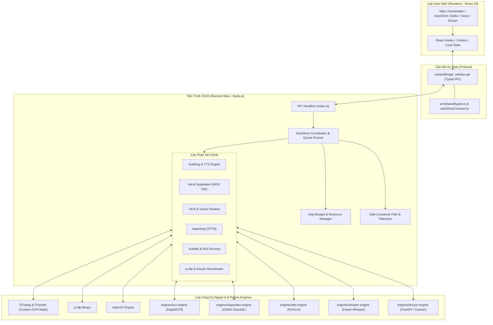
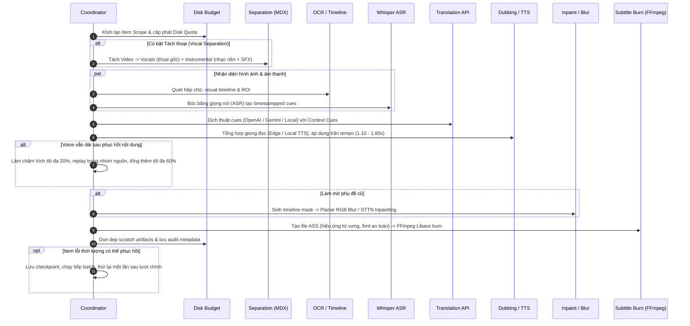

# Kiến Trúc Hệ Thống TediaPros (System Architecture)

Tài liệu này cung cấp cái nhìn toàn diện về cấu trúc kiến trúc, ranh giới giữa các module và luồng dữ liệu bên trong **TediaPros**.

---

## 1. Sơ Đồ Khối Tổng Thể

Hệ thống được thiết kế theo mô hình **Hybrid Desktop Shell + Multi-Engine Orchestrator**:

---

## 2. Pipeline AutoShort (Quy Trình Xử Lý Video Tự Động Từ A-Z)

AutoShort là tính năng phức tạp nhất trong TediaPros. Mỗi video chạy qua pipeline độc lập được điều phối bởi [autoShortItemCoordinator.ts](file:///f:/Son/tool/TediaPros/src/main/autoShortItemCoordinator.ts):

---

## 3. Ranh Giới Module & Trách Nhiệm Chi Tiết

### 3.1. `src/renderer/` (Frontend React 19)
- **Trách nhiệm:** Trình diễn giao diện, nhận input từ người dùng, hiển thị tiến độ và logs thời gian thực.
- **Ranh giới:** Tuyệt đối không gọi trực tiếp API Node.js (`fs`, `child_process`, `path`). Mọi tương tác với hệ thống phải qua `window.api` (preload bridge).

### 3.2. `src/preload/` (Security Bridge)
- **Trách nhiệm:** Expose các hàm invoke/on an toàn sang `window.api` bằng `contextBridge.exposeInMainWorld`.
- **Ranh giới:** Chịu trách nhiệm dọn dẹp listener IPC khi renderer unmount, không để lộ object `ipcRenderer` thô.

### 3.3. `src/shared/` (Single Source of Truth)
- **Trách nhiệm:** Định nghĩa toàn bộ TypeScript interfaces, types, enums, và schema validation (e.g. `autoShortContract.ts`).
- **Ranh giới:** **Isomorphic code** — không được import bất kỳ thư viện đặc thù nào của Node (`node:fs`, `electron`) hoặc của Browser/DOM (`window`, `document`).

### 3.4. `src/main/` (Electron Orchestrator)
- **Trách nhiệm:**
  - Vòng đời ứng dụng, quản lý cửa sổ BrowserWindow.
  - Điều phối hàng đợi tác vụ đa tiến trình với `autoShortQueueRunner.ts` và `autoShortItemCoordinator.ts`.
  - Quản lý bộ nhớ đĩa tạm (`autoShortDiskBudget.ts`).
  - Gọi và giám sát tiến trình con (`processTree.ts`), đảm bảo khi người dùng bấm Hủy (Cancel) thì toàn bộ cây tiến trình FFmpeg/Python bị tiêu diệt sạch sẽ. Mỗi scope render Auto Short mới đặt lại cờ hủy nội bộ sau khi chiếm render lock; vì vậy trạng thái hủy của job trước không làm lần render sau bỏ qua FFmpeg.
  - Lưu nhật ký theo từng session trong `userData/logs`. Đóng ứng dụng không xóa bằng chứng; chỉ thao tác Clear của người dùng mới xóa log. `logRetention.ts` giữ file đang hoạt động và dọn session cũ theo giới hạn 7 ngày/100 MiB.
  - Telemetry AutoShort tách thời gian `metadata`, `visual_ocr`, `asr`, `translate`, `tts`, `separation`, `audio`, `sttn`, `retime`, `render`, `artifact_copy` và `publish`. Request TTS ghi mốc queue/start/first-response/end, HTTP status, request ID và retry reason; render ghi từng encoder attempt và codec được chọn.
  - Main Process là nguồn sự thật của hàng đợi AutoShort. Mỗi batch có snapshot checksum trong `userData/autoshort-batches-v1`; ghi `pending` trước preflight, `running` trước engine và trạng thái cuối kèm biên nhận SHA-256 trước event UI. Khi khởi động lại, `running` đổi thành `interrupted`; ứng dụng chỉ tiếp tục sau thao tác người dùng và chỉ với video `pending/interrupted` có input/config digest còn khớp.

### 3.5. `engines/` (Python Sidecars)
- **Trách nhiệm:** Thực thi các tác vụ máy học nặng (OCR, Whisper, STTN Inpainting, MDX Separation).
- **Ranh giới:** Giao tiếp qua Stdio JSON hoặc CLI arguments. Có thể chạy độc lập, có test riêng bằng `unittest`.

---

## 4. Quản Lý Tài Nguyên & An Toàn Hệ Thống

1. **Ngân Sách Đĩa (Disk Budgeting):**
   - Trước khi bắt đầu job, hệ thống tính toán dung lượng ước tính cần thiết.
   - Nếu ổ đĩa đích không đủ khoảng trống tối thiểu, tác vụ sẽ bị từ chối kèm cảnh báo rõ ràng.
   - Mỗi video có thư mục làm việc riêng (`itemScope.scratchDir`), tự động dọn sạch sau khi xuất thành phẩm.

2. **Chống Tấn Công Directory Traversal:**
   - Mọi đường dẫn file font, file phụ đề, video xuất ra đều đi qua `safeContainedPath(baseDir, relativePath)`.
   - Ngăn chặn triệt để việc ghi đè file hệ thống ngoài ý muốn.

3. **Phục Hồi Lỗi & Fallback:**
   - Khi tách thoại DirectML gặp lỗi OOM hoặc không có GPU tương thích: Tự động chuyển fallback sang CPU mà không làm sập tiến trình chính.
   - Khi dịch thuật API gặp rate-limit: Cơ chế retry với exponential backoff.
