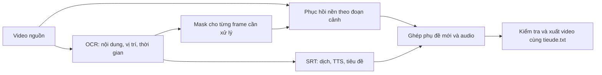

# Tham khảo ba repo để xóa phụ đề có sẵn

Ngày kiểm tra: 2026-09-05. Phạm vi: đọc README, mã inference/tích hợp, license và đối chiếu pipeline TediaPros. Chưa tải model, cài dependency hoặc benchmark inference. Những lựa chọn bên dưới là đề xuất để thử nghiệm, chưa phải tính năng đã tích hợp.

## Kết luận lựa chọn

Nên dùng video-subtitle-remover làm tài liệu tham khảo về quy trình xử lý video, STTN làm ứng viên đầu tiên cho phục hồi nền theo thời gian, LaMa làm ứng viên đối chiếu cho phục hồi từng ảnh. Giữ blur hiện có như một lựa chọn riêng. Chỉ chọn mặc định sau khi so sánh output trên các đoạn video thật của người dùng.

Inpainting dự đoán nội dung bị chữ che dựa trên thông tin còn lại. Nó có thể tạo kết quả tự nhiên hơn blur nhưng không bảo đảm khôi phục chính xác cảnh gốc đã bị che; đây là giới hạn cần thể hiện trong cách đánh giá chất lượng.

## 1. cookieranger/lama-cleaner

Repo cung cấp công cụ phục hồi ảnh, hỗ trợ CPU/GPU và cách xử lý ảnh gốc, resize hoặc crop vùng cần sửa. Phù hợp để tham khảo cách nạp model và xử lý vùng nhỏ. [README](https://github.com/cookieranger/lama-cleaner)

Adapter LaMa nhận một ảnh và một mask, trả ảnh đã phục hồi; không có đầu vào các frame lân cận. Suy luận kỹ thuật: khi áp dụng độc lập từng frame video, cần kiểm tra nhấp nháy và sự thay đổi kết cấu nền qua thời gian. Chạy nhiều ảnh theo batch không tự tạo tính liên tục giữa frame. [Adapter LaMa](https://github.com/cookieranger/lama-cleaner/blob/main/lama_cleaner/model/lama.py), [LaMa trong VSR](https://github.com/YaoFANGUK/video-subtitle-remover/blob/main/backend/inpaint/lama_inpaint.py)

Repo liên quan Sanster/IOPaint hiện đã archive từ 13/08/2025; không nên mặc định dựa vào cập nhật tương lai của nó. [Trạng thái IOPaint](https://github.com/Sanster/IOPaint)

## 2. researchmm/STTN

Đây là repo nghiên cứu video inpainting ECCV 2020, dùng thông tin không gian và thời gian từ nhiều frame. Vì vậy phù hợp để đánh giá nền chuyển động trong video của người dùng. Repo không tự cung cấp pipeline phát hiện phụ đề hoàn chỉnh. [README STTN](https://github.com/researchmm/STTN)

Script demo cố định 432×240, xuất 24 fps, chọn `cuda:1` nếu có CUDA và tải cả video vào bộ nhớ. Không có bước ghép audio. Đó là các giả định của demo phải thay khi dùng trong TediaPros, đặc biệt máy chỉ có một GPU. [test.py](https://github.com/researchmm/STTN/blob/master/test.py)

## 3. YaoFANGUK/video-subtitle-remover

Đây là repo gần bài toán sản phẩm nhất: CLI có lựa chọn STTN, LaMa, ProPainter, OpenCV và vùng phụ đề. README mô tả các runtime CPU/CUDA/DirectML. Tuy nhiên, các ví dụ cấu hình cũ trong README không phải lúc nào cũng khớp Config hiện tại; cần theo mã ở commit được chọn. [README tiếng Anh](https://github.com/YaoFANGUK/video-subtitle-remover/blob/main/README_en.md), [Config hiện tại](https://github.com/YaoFANGUK/video-subtitle-remover/blob/main/backend/config.py)

Các điểm không nên sao chép nguyên trạng:

- `STTN_AUTO` dựng mask từ vùng người dùng chọn và bỏ qua phát hiện chữ. Nhánh có detection nới/gộp khoảng và hợp các hộp thành mask dùng chung cho batch. Không thể đồng nhất hai cách này với mask chính xác riêng từng frame. [Luồng xử lý](https://github.com/YaoFANGUK/video-subtitle-remover/blob/main/backend/main.py)
- Wrapper STTN_DET crop dải ảnh, resize về 432×240 rồi resize kết quả lên và gán lại cả dải. Dù bên trong model có ghép mask, phần ngoài chữ trong dải vẫn đi qua resize. Với TediaPros nên chỉ ghép phần phục hồi vào mask cuối trên frame nguồn đầy đủ để hạn chế giảm chi tiết ngoài chữ. [STTNDetInpaint](https://github.com/YaoFANGUK/video-subtitle-remover/blob/main/backend/inpaint/sttn_det_inpaint.py)
- Có tên DirectML trong danh sách hỗ trợ không chứng minh mọi model đều chạy tốt. Bộ chọn thiết bị ưu tiên DirectML nếu module hiện diện; mã có ghi nhận xung đột giữa các runtime. Cần kiểm tra theo từng model/provider. [HardwareAccelerator](https://github.com/YaoFANGUK/video-subtitle-remover/blob/main/backend/tools/hardware_accelerator.py)
- STTN_AUTO và STTN_DET có đường dẫn checkpoint khác nhau; không được thay thế tùy tiện bằng một file STTN bất kỳ. [ModelConfig](https://github.com/YaoFANGUK/video-subtitle-remover/blob/main/backend/tools/model_config.py)

## Đối chiếu với TediaPros

Mã hiện tại đã có điểm nối sau khi lấy timeline OCR và trước `deps.burn`: [autoShortItemCoordinator.ts](F:/Son/tool/TediaPros/src/main/autoShortItemCoordinator.ts:628). Có thể giữ OCR phục vụ SRT và tạo tiêu đề; thêm bước phục hồi nền trước khi ghép phụ đề mới.

Luồng đề xuất:

Các yêu cầu kỹ thuật rút ra từ audit của app:

1. Không dùng trực tiếp mask blur nới rộng làm mặc định inpainting. Mask nhỏ dễ hở viền chữ; mask quá rộng buộc model vẽ lại nhiều cảnh. Cần profile mask riêng, phủ đủ chữ/viền/bóng và ổn định qua thời gian.
2. Timeline OCR 8 fps hiện tại phải được ánh xạ theo timestamp sang frame video đầy đủ. Xóa chữ bằng model tốt vẫn thất bại nếu OCR bỏ sót thời điểm có chữ. Cần giữ đúng PTS, rotation, SAR và thời lượng khi chuyển qua worker.
3. Chia theo cảnh, xử lý cửa sổ có frame chồng lấn để kiểm soát RAM/VRAM và giảm đường nối giữa batch. Tách inference model khỏi Electron bằng worker riêng; quản lý tải model, tiến độ, hủy tác vụ và lỗi thiếu bộ nhớ.
4. Ghép vào đúng mask trên frame nguồn; bỏ qua inference ở frame không cần sửa. Chỉ thêm phụ đề dịch sau khi xóa chữ gốc. Tránh encode mất dữ liệu qua nhiều file trung gian.
5. Giữ lựa chọn blur hiện có. Khi xóa AI lỗi, báo rõ để người dùng quyết định thử lại/đổi chế độ; không báo xóa thành công sau khi tự chuyển sang blur.

Đây là đề xuất tích hợp của lượt review, không phải mô tả tính năng đang tồn tại.

## Phần cứng và kiểm chứng cần làm

Đã đọc trực tiếp bằng `nvidia-smi`: NVIDIA GeForce GTX 1660 SUPER, 6144 MiB, driver 595.79. Điều này xác nhận phần cứng hiện tại, chưa xác nhận PyTorch/model tương thích hoặc tốc độ inference.

Ưu tiên thử STTN với CUDA, crop vùng có ngữ cảnh và cửa sổ nhỏ; đối chiếu LaMa trên cùng frame/mask. Chưa chọn ProPainter làm mặc định: repo mô tả chi phí VRAM cao và cấu hình ví dụ có thể vượt 6 GB. Những số liệu của tác giả không phải benchmark trên máy này. [Thông số tham khảo](https://github.com/YaoFANGUK/video-subtitle-remover/blob/main/backend/config.py)

Phép thử tiếp theo nên gồm các đoạn 5–10 giây: nền ít chuyển động, camera lia, chữ đi qua lông mèo/chi tiết nhỏ, đổi cảnh và khoảng không có chữ. So sánh cùng đoạn giữa nguồn, blur hiện tại, STTN và LaMa; đo thời gian, peak VRAM/RAM, dư chữ, nhấp nháy, biến dạng, ảnh ngoài mask, đồng bộ audio và thời lượng. Không chọn phương án chỉ từ một ảnh đẹp.

## Giấy phép cần phân biệt khi đóng gói

License ở root của lama-cleaner và VSR là Apache-2.0; STTN là MIT. Đây chưa phải kết luận về mọi dependency và checkpoint được đóng gói. [LaMa Cleaner LICENSE](https://github.com/cookieranger/lama-cleaner/blob/main/LICENSE), [VSR LICENSE](https://github.com/YaoFANGUK/video-subtitle-remover/blob/main/LICENSE), [STTN LICENSE](https://github.com/researchmm/STTN/blob/master/LICENSE)

ProPainter có S-Lab License với điều khoản sử dụng phi thương mại và yêu cầu liên hệ cho mục đích thương mại. Vì vậy license Apache của ứng dụng VSR không đủ để kết luận có thể đóng gói mọi model của nó vào sản phẩm thương mại. [ProPainter LICENSE](https://github.com/sczhou/ProPainter/blob/main/LICENSE)

## Giới hạn bằng chứng

Đã đọc nguồn trực tuyến và mã app hiện tại; chưa chạy bất kỳ model inpainting nào. Các URL main/master là nhánh có thể thay đổi. Trước khi triển khai cần chọn commit/checkpoint cụ thể, ghi checksum và kiểm tra lại dependency/license. Không đưa cam kết tốc độ, VRAM tối thiểu hay tỷ lệ xóa sạch từ lượt tham khảo này.
