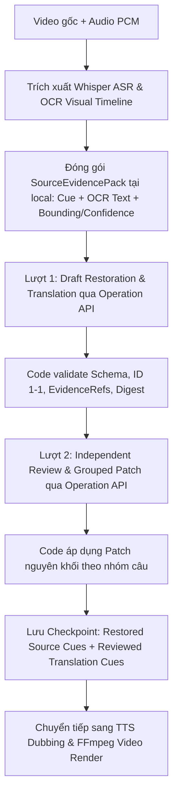

# Kế Hoạch Chi Tiết P5: Khôi Phục Nguồn Audio/OCR & Dịch Tự Nhiên AutoShort

- **Ngày:** 2026-09-17.
- **Trạng thái:** Đã triển khai, kiểm chứng offline bằng fake Operation API/media, và xác nhận live transport canary; chưa đo semantic accuracy trên video thật.
- **Model:** Gemini 3.1 Pro (alias `gemini-advanced`) qua Gemini Gateway V2.
- **Mục tiêu:** Sử dụng kết hợp audio gốc và OCR visual timeline để tự động đối chiếu ASR, khôi phục từ đồng âm/từ sai, sửa nguồn có bằng chứng, dịch chuẩn xác và review 2 lượt mà không làm mất ID/cue hay thay đổi thời lượng video. Tất cả request media, review, repair đều tuân thủ Upstream Governor (concurrency = 1).

---

## 1. Cơ Sở Mã Nguồn & Bằng Chứng Thực Tế

### 1.1 Hiện trạng pipeline AutoShort (`src/main/autoShortItemCoordinator.ts`)
- Hiện tại, `config.subtitleMethod === 'whisper-ocr'` gọi song song `runWhisper()` và `getVisualOcr()`, sau đó dùng `fuseWhisperAndOcr` để gộp thô.
- Khi chuyển sang bước dịch (`translateStrict`), pipeline chỉ nạp text SRT đơn thuần từ file `rawSrtPath`.
- **Hạn chế thực tế:**
  - Whisper ASR rất dễ nhận diện sai các từ đồng âm (homophones) hoặc từ lóng/tên riêng (ví dụ ca thực tế Volvo 44-cue: `沃尔沃` bị nhận nhầm thành `窝耳窝`, `像素` thành `橡树`, `上万次` thành `上弯字`).
  - Phụ đề OCR trên video có chữ đúng (`沃尔沃`), nhưng do không được chuyển làm bằng chứng cho LLM, bản dịch bị sai lệch nghiêm trọng ("cành cây pixel", "Wooting").

### 1.2 Bằng chứng kiểm tra và invariants bất khả xâm phạm
1. **Bảo toàn Cue ID & Timestamps:** Timestamp và ID do code local quản lý; LLM không được tự ý xóa bỏ cue, gộp câu làm mất ID, hoặc tạo timestamp mới.
2. **Governor Concurrency = 1:** Mọi request generation (draft, review, repair) đều phải gửi qua Operation API (`/gateway/requests`) đã hoàn thành ở P2/P3.
3. **Restoration có Evidence:** Chỉ khôi phục text nguồn khi có bằng chứng rõ ràng từ OCR hoặc Audio. Không cho phép LLM đoán mò hoặc tự ý thêm thông tin ngoài video.
4. **Giới hạn nhịp độ Dubbing:** Trần tempo 1.80x; câu thoại sau dịch và sửa phải vừa với thời lượng phát âm của video gốc.

---

## 2. Kiến Trúc Pipeline Khôi Phục & Dịch (2-Pass Media Restoration)

### 2.1 Bước 1: Chuẩn bị SourceEvidencePack tại máy (Zero Generation Cost)
Trước khi gửi bất kỳ request nào qua gateway:
- **ASR Cues:** Danh sách cue chuẩn trích xuất từ Whisper (`id`, `start`, `end`, `text`).
- **OCR Evidence:** Danh sách text OCR phát hiện từ các khung hình kèm timestamp và độ tin cậy (`id`, `text`, `timestamp`, `confidence`, `region`).
- **Glossary & User Guidance:** Từ điển thuật ngữ do người dùng cấu hình (nếu có).
- Mã băm `evidencePackDigest` được tính toán từ toàn bộ tập bằng chứng để đảm bảo tính toàn vẹn.

### 2.2 Bước 2: Lượt 1 — Khôi Phục Nguồn & Dịch Toàn Bài (Draft Generation)
- Gửi `SourceEvidencePack` đến Gemini Gateway qua Operation API chung.
- Output yêu cầu cấu trúc `restoration-translation-v1`:
  - `sourceEdits`: Danh sách các câu được sửa kèm `evidenceRefs` (chỉ sửa khi có bằng chứng từ OCR hoặc ngữ cảnh chặt chẽ).
  - `entities`: Bảng thực thể/thuật ngữ nhất quán trong toàn video.
  - `items`: Bản dịch đầy đủ cho từng cue theo đúng `id` (1-1 cardinality).
  - `uncertainties`: Các điểm mơ hồ cần lượt review chú ý.
- **Code Validation:**
  - Kiểm tra số lượng item trả về phải khớp 100% tập ID nguồn.
  - Kiểm tra mọi `evidenceRefs` trong `sourceEdits` phải thực sự tồn tại trong pack.
  - Loại bỏ các format bọc Markdown hoặc protocol contamination.

### 2.3 Bước 3: Lượt 2 — Independent Audit & Patching (Review Generation)
- Mở một operation request riêng biệt (clean context, không mang rác đàm thoại).
- Reviewer nhận: `rawSourceCues`, `candidateDigest`, `sourceEdits`, `entities`, `items`.
- Reviewer kiểm tra:
  - Nguồn sửa có căn cứ xác thực không hay là ảo giác (hallucination).
  - Bản dịch có sai lệch số lượng, đơn vị, phủ định, hoặc thiếu tự nhiên tại địa phương không.
  - Trả về `findings` và `replacements` theo nhóm câu (`groupId`).
- **Code Validation & Patch Application:**
  - Áp dụng replacement nguyên khối cho nhóm câu, không để tình trạng nửa câu cũ nửa câu mới.
  - Kiểm tra lại toàn bộ tập cue sau patch để đảm bảo không mất cue nào.

### 2.4 Bước 4: Lưu Checkpoint & Chuyển Sang Dubbing
- Lưu song song `rawSourceCues`, `restoredSourceCues`, và `translatedCues` vào checkpoint của item.
- Khi người dùng resume batch hoặc retry, không cần chạy lại ASR hay OCR nếu media digest không đổi.
- Bản dịch đã hoàn thiện được chuyển sang mô-đun TTS để đo đạc thời lượng và tổng hợp giọng nói.

---

## 3. Các Ràng Buộc Kỹ Thuật Khi Triển Khai

1. **Payload & Size Limit:** Giới hạn request body tối đa 4MB (`max_request_body_bytes`). Bằng chứng hình ảnh/audio nặng (nếu có) được nén hoặc trích xuất text/timestamps trước khi gửi, tránh vượt ngưỡng HTTP.
2. **Governor Safety:** Sử dụng `submitGatewayOperation` và `pollGatewayOperation` với lease file độc quyền; không chạy song song nhiều generation.
3. **Đo Lường Chất Lượng:** Viết bộ test fixture kiểm tra:
   - Số lỗi ASR được sửa đúng (True Positives).
   - Số câu đúng KHÔNG bị sửa sai (False Positives = 0).
   - Cue identity và timing được bảo toàn 100%.
