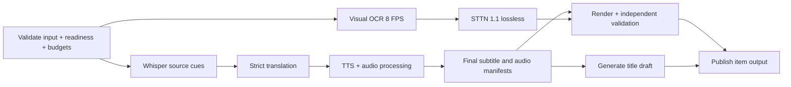

# Specification: Auto Short throughput và phục hồi hàng đợi

Ngày: 2026-09-06. Trạng thái: **đề xuất để triển khai**, chưa phải tính năng hiện có.
Phạm vi: TediaPros Windows, cấu hình người dùng trong
`AUTO_SHORT_CONFIG_NOTE_2026-09-06.md`, đặc biệt Whisper CPU + STTN CUDA +
dịch/clone voice nội bộ + nhạc replace + tiêu đề Gemini, queue 10–15 item.

## 1. Mục tiêu và ranh giới

Giảm thời gian tới video đầu tiên và tới lúc hoàn tất cả queue, giảm file tạm,
giữ chất lượng subtitle/voice/erasure. Bảo toàn source, output cũ, những thay
đổi đang có trong working tree và STTN 1.1.0 đã được kiểm chứng.

Không đặt SLA phút/video khi chưa có baseline thành công. Không đổi model,
giọng, FPS, output resolution hoặc timing để làm benchmark đẹp hơn. Lượt này
chỉ tạo audit, specs, plan; chưa sửa production hay cấu hình user/server.

Nguồn evidence: `../../benchmarks/2026-09-06-autoshort-throughput-audit.md`.
Điểm chưa xác định: effective OCR providers trong lần cũ; stage 21 phút cuối;
server GPU/model residency, batch API, clone session, concurrency và per-request
timing. GET schema server trả 403; không coi bất kỳ API đề xuất nào là đã tồn tại.

## 2. Kiến trúc lựa chọn

Giữ các adapter ASR/OCR/translation/TTS/STTN/burn hiện có. Thêm lớp stage runner
và scheduler có giới hạn tài nguyên thay vì chạy nhiều `processSingleVideo`
đồng thời không kiểm soát. Triển khai theo cờ, bắt đầu một item rồi mở hai item.

Với `subtitleMethod=ocr`, source cues phụ thuộc O, do đó T không chạy trước O.
Với `whisper-ocr`, merge phụ thuộc cả A và O rồi mới T. Với STTN off, bỏ S;
với TTS off, bỏ N; với title off bỏ H. Mỗi node được gọi đúng một lần cho một
attempt; fan-out chia sẻ promise/artifact đã validate, không OCR hai lần.
STTN đọc source gốc và visual timeline, không đọc SRT dịch; render chỉ bắt đầu
khi media sạch và audio/subtitle cuối đã được xác thực. Title dùng SRT cuối đã
trim theo duration, không dùng bản SRT dịch sớm nếu TTS có sửa spoken text.

Các phương án không chọn làm mặc định: 10–15 full pipelines đồng thời (OOM và
model thrashing); giảm FPS/đổi model (đổi chất lượng); nối STTN trực tiếp final
encoder (phức tạp retry/timeline, để giai đoạn sau).

## 3. Telemetry bắt buộc trước tối ưu

### 3.1 Event schema dự kiến

`AutoShortStageEventV1` gồm:

- `schemaVersion=1`, `jobId`, `itemId`, `attemptId`, `stageId`, `eventId`.
- `stage`: validate | asr | visual_ocr | translate | tts | audio | sttn | render |
  title | publish; `phase`: queued | resource_wait | cache_lookup | loading |
  running | validating | committing | succeeded | failed | cancelled.
- `timestampUtc`, `monotonicElapsedMs` (chỉ hiệu lực trong process),
  `queueWaitMs`, `activeMs`, `totalMs`; nested spans có `parentSpanId`.
- Engine/model version và content hash khi có; requested/effective provider,
  fallback reason, endpoint alias/resource-group, worker PID do app tạo.
- Các counters tùy stage: frames/samples, det/cls/rec calls, recognized regions,
  cue count, request/cache hit/miss/retry count, bytes read/written,
  current/peak temporary bytes, RSS/VRAM khi đo được; không có số đo trả null.
- Request spans có batch cue count, source chars, token budget, estimated/actual
  tokens tách biệt, response status, schema failure category; TTS có upload,
  wait/download, audio duration và local DSP duration. Server queue/inference
  chỉ ghi nếu server trả telemetry, không suy từ RTT.

Không lưu key, Authorization header, token URL, reference audio, nguyên văn
prompt/subtitle vào performance log. Endpoint biểu diễn alias; private path
redact. Subtitle audit hiện có giữ theo policy riêng, không nhân bản vào log.

Ghi JSONL append dưới job diagnostics + summary JSON atomic. Flush terminal
events trước khi cleanup work. Log vòng đời phải còn ở lỗi/hủy/restart. Khi
app crash, span chưa terminal thành `interrupted`, không báo succeeded.
Telemetry I/O thất bại không được phá video đã publish; hiển thị cảnh báo thiếu
diagnostics. Giới hạn log 20 MiB/job, coalescing progress tối đa 1 Hz/item;
terminal và lỗi không bị bỏ. Không cộng active spans chồng nhau thành wall time.

UI hiển thị stage thật, elapsed, cache hit, nguyên nhân chờ tài nguyên và số item
hoàn tất. ETA là khoảng p50–p90 từ cấu hình/provider tương tự; ít mẫu thì ghi
“chưa đủ dữ liệu”, không dùng % stage cố định làm thời gian còn lại. Sửa khả năng
progress lùi từ audio 83 về OCR 5 khi nhánh nền bắt đầu.

## 4. OCR streaming ROI

### 4.1 Luồng giữ chất lượng ban đầu

Thay full-video PNG bằng FFmpeg stdout chứa frame timestamp + pixels; đọc đủ
frame, phát hiện EOF ngắn/hỏng, drain stderr bounded, timeout và cancellation
chung với process-tree helper. Decode display-space theo cùng rotation/SAR/
scale/setsar; resample cùng 8 FPS, frame k ứng với [k/8,(k+1)/8), clip duration.

Crop **sau** canonical geometry và sample, ROI cộng halo thử nghiệm 32 pixel,
clamp trong display bounds; không upscale/downscale ROI ngoài transform cũ.
Halo là detector context, output mask vẫn bị giới hạn ROI gốc. Chuyển tọa độ
polygon crop về display-space trước normalize/clip; mọi box giữ confidence,
text/order và frame indices. Không tự giữ text ngoài vùng quét.

Initial mode `accurate-stream-roi-v1`: det+cls+rec mỗi mẫu, giữ chất lượng
text/box contract; không lén thay thành detection-only vì timeline validator
hiện cần text/confidence. ROI có thể thay kết quả detector dù pixels nguồn
giữ nguyên; phải qua corpus gate, nếu chưa đạt giữ full-frame stream mode.

Bounded buffer tối đa 4 sampled frames + một OCR in-flight; không tích lũy
numpy/full PNG theo duration. OCR session một consumer. CPU/DML provider phải
được báo từ session thực tế từng det/cls/rec; startup probe không đủ. Ghi
decodeMs, detMs, clsMs, recMs và effective crop pixels. FFmpeg pipe tồn tại trên
RAM; file nhỏ sidecar/work đặt ổ output, không còn TemporaryDirectory PNG ổ C.

Legacy accurate path vẫn selectable để A/B/rollback. Engine feature flag mới
`visual-stream-roi-v1`; renderer/main chỉ gửi khi binary advertise capability.
Không gán profile `fast` vào accurate để vượt policy. Protocol/schema cũ tiếp
tục hỗ trợ trong giai đoạn migration; cache key có implementation fingerprint.

### 4.2 Tối ưu OCR sâu chỉ sau baseline

Detection 8 FPS + recognition khi đổi vùng/chữ, track bbox giữa mẫu, gộp đoạn
ổn định; không bỏ frame chỉ vì global image hash gần nhau. Temporal gaps,
scene cuts, chữ karaoke/chuyển động, chữ thoáng qua phải reset/re-detect.
Để dùng detection-only cho STTN cần schema riêng `text-mask-timeline` và adapter
độc lập, không giả text hoặc confidence. Whisper-ocr/OCR subtitle vẫn cần rec.
Đây là experiment off mặc định, không thuộc release P1.

## 5. Dịch và voice pipeline

### 5.1 Dịch batch bounded

Local dubbing policy riêng, không đổi global 20.000 ký tự cho mọi provider.
Candidate khởi điểm: tối đa 24 cue/batch, khoảng 2.000 source chars, output
budget 2.048 tokens; dùng cả giới hạn context/token model khi biết. Chọn ranh
giới semantic gần nhất trước cap, context trước/sau chỉ read-only. Nếu một
group vượt cap, chia tại cue boundary có context; một cue quá dài thì báo xử lý
đặc biệt hoặc fail rõ, không truncate text/nhân cue ID.

Những số trên là giá trị thử nghiệm, chọn final bằng sweep 12/24/40 cue trên
117 cue và corpus. Không chạy nhiều lần dịch server thật nếu chưa có corpus,
chi phí và measurement scope cụ thể. Validate exact ID set, order reconstruction,
no duplicates/unknown/missing, source-script echo và target language policy.

Schema failure của batch lớn: split ngay một lần thay lặp lại nguyên prompt
lớn; mỗi leaf cho tối đa một repair. Client giữ deadline 10 phút/item và retry
wall time; request-count ceiling không bật mặc định để tránh làm hỏng các batch
chỉ thiếu/thừa một phần. Có thể truyền `maxRequests` để bật quota explicit khi
môi trường yêu cầu. Transport 429/503 tuân Retry-After trong deadline, không
nhân retry của transport với schema vô hạn. Không coi partial invalid response
là translation cache hoàn chỉnh. Mỗi batch hợp lệ commit độc lập theo fingerprint.

### 5.2 TTS không đánh đổi đồng bộ

Giữ `buildDubbingPlan` source-anchored, cache hiện có và bootstrap ≤3 không
synthesize lại. Request server speed=1; không tăng tempo ceiling để đạt KPI.
P1 chồng synthesize cue kế tiếp với trim/probe cue trước trên CPU, queue depth=1.
Rephrase/tempo/finalize commit theo cue index và predictor update theo thứ tự
định trước; cùng inputs/cache phải cho cùng plan/timing như baseline.

Nếu current cue cần rephrase phụ thuộc predictor, không precompute decision
sai thứ tự. Next original-text audio có thể prefetch, nhưng chỉ dùng nếu final
text fingerprint còn khớp. TTS cancellation dừng request mới, abort request
in-flight, drain local children và không publish partial cache.

Chuẩn bị reference audio một lần/job (đọc/hash, MIME và transcript) để tránh
lặp disk read. Nếu API vẫn multipart thì vẫn phải upload mỗi request; không
claim loại được embedding cost phía server. Content-hash reference và server
model revision thay path/mtime đơn thuần trong cache mới; reuse v2 chỉ khi key
đã xác minh, nếu không cold miss an toàn. Cùng key có single-flight và atomic
write; cache lỗi bị quarantine trong phạm vi cache, fetch lại tối đa một lần.

Không gộp nhiều cue thành WAV dài trừ khi server trả alignment sourceCueId
được kiểm chứng và voice/timing vượt acceptance. Concurrency server mặc định=1.

### 5.3 Server optimization extension (chưa có contract live)

Cần server owner xác nhận: hardware/resources group, max concurrency/queue,
model revision, model residency, clone conditioning reuse, batch input/output
limits, cancellation, auth scope. Có thể thêm optional capabilities cho
`maxConcurrency`, `supportsCloneSession`, `supportsBatchWithAlignment`,
`supportsRequestTiming`, `serverResourceGroup`; không tự gọi endpoint tưởng tượng.

Nếu có clone session: tạo session bằng reference hash+model rev+transcript+options,
nhận opaque ID+TTL, dùng ID trong synthesis, hết hạn thì tạo lại đúng một lần;
session identity phải nằm trong account scope, không share giữa người dùng.
Batch phải trả mapping ID, per-item errors, audio and alignment. Gói audio lớn
stream ra disk có giới hạn bytes, không giữ toàn batch base64 trong RAM.

Concurrency 2 chỉ bật sau A/B 1 vs 2 cho cùng workload, quality/no OOM/no 429
và throughput tăng thực. Server LLM và TTS mặc định chung mutex khi chưa chứng
minh độc lập; endpoint khác nhau không chứng minh GPU khác nhau.

## 6. Resource scheduler

Các tài nguyên đề xuất và capacity ban đầu:

| Resource | Capacity | Quy tắc |
| --- | ---: | --- |
| `local-gpu-heavy` | 1 | OCR DML, STTN CUDA, Whisper CUDA, separation dùng chung |
| `local-cpu-heavy` | 1 | ASR CPU/full software render; CPU OCR cũng tính vào đây |
| `local-audio-dsp` | 1 | Clip trim/stitch, bounded subprocesses |
| `server-inference:<group>` | 1 | Dịch/TTS cùng group; khóa shared không per item |
| `external-title:<provider>` | 1 | Rate limit/backoff riêng |
| `active-item` | 1 rồi 2 | P1 intra-item trước; P2 queue lookahead=1 |
| `temporary-disk:<volume>` | bytes | Admission + monitoring, không nhân hàng đợi thành 15 intermediates |

Resource claim atomic theo tập, không giữ A trong lúc đợi B gây deadlock. Fair
FIFO giữa item có ưu tiên hoàn tất item sớm, aging tránh đói tài nguyên. Release
lease chỉ khi tất cả process/request thuộc stage đã settled. Không giữ GPU
lease khi đang chờ mạng. NVENC vẫn dùng GPU resources; chỉ tách lane riêng sau
benchmark VRAM/load với STTN, mặc định serialize.

CPU budget khởi điểm: giữ ít nhất 2 logical CPU cho UI/OS; tổng thread claim
≤10 trên máy 12 threads; giá trị portable theo cpu count. Nếu OCR/STTN không
điều khiển được threads thì coi heavy stage độc quyền cho profile conservative.
ASR CPU và OCR DML được phép overlap chỉ khi CPU budget được đo; tắt overlap
ASR/OCR nếu tăng end-to-end hoặc UI lag. VRAM peak từ telemetry để quyết định,
không gán GTX có 6 GiB nghĩa là luôn còn 6 GiB.

Queue tối đa 2 active item, còn lại chỉ metadata. Nếu một clean intermediate
đang chờ nhánh server, không cho STTN item sau tích file lớn không giới hạn.
Giới hạn initial completed-clean lookahead=1. Có thể làm ASR/OCR metadata item
sau nhưng phải nằm trong active-item cap và disk budget. Disk admission gồm
output STTN ước lượng từ sample/observed rate có safety factor, final output,
retained cache, workers in-flight. Giữ rolling safety margin 1.1.0 và reserve
ledger liên item; không coi 0,685 GiB là tổng dung lượng video.

Đồ thị chạy trong job: `maxActiveItems=1|2`, `overlapIndependentStages`,
`resourceProfile=conservative|qualified`, policy snapshot bất biến. App giữ một
activeJob như cũ; job-wide scheduler áp dụng cả preview để không tranh GPU
ngoài queue. Preview chờ lease hoặc báo GPU bận, không ngầm chạy cạnh STTN.

## 7. Cache/resume theo stage

Cache root selectable trên ổ output/F, mặc định tối đa 20 GiB cho artifacts nhỏ;
clean video lớn chỉ giữ cho pending/retry item và tính vào disk admission.
Không mặc định giữ 15 FFV1 cache. TTL metadata/ASR/OCR/translation/TTS 7 ngày
(giá trị rollout có thể điều chỉnh); eviction LRU chỉ unleased entries do app
sở hữu, không chạm output/video source. Explicit pinned jobs không bị eviction.

`StageArtifactV1`: schema, inputFingerprint, stageImplementation, runtime/model
hashes, relevantConfigHash, artifact path/bytes/hash, createdAt, validation,
status=complete. Ghi partial trong private directory, validate rồi atomic
commit; lock/single-flight cùng key giữa items. Never trust manifest path to
escape cache root; reject symlink/reparse target khi verify/evict.

Keys theo dependency: ASR=input content+ASR model/version/language/device;
OCR=input+canonical geometry+ROI+FPS+implementation+provider/model;
translation=source cue digest+language+model rev+prompt/batch policy;
TTS=final text+voice/reference hash+options+model rev; STTN=input+visual mask
digest+model/engine+provider. Burn/title font/music/style đổi không invalidates
ASR/OCR; ROI đổi invalidates OCR/STTN, source text chỉ đổi nếu OCR là source.
Hash input streaming một lần, dùng size/mtime nhanh để phát hiện thay đổi nhưng
không coi metadata là content identity khi reuse xuyên item/restart.

Legacy checkpoint v5 vẫn đọc trong chế độ tuần tự cũ. Migration không ghi đè
checkpoint cũ; chỉ promote stages đã xác minh. Retry giữ item identity qua UI;
re-add cùng file vẫn tìm cache theo content/config, không phụ thuộc random ID.
Job manifest lưu thứ tự queue, immutable config, stages, artifact refs và retry
attempts; crash recovery đánh dấu running interrupted, reacquire resources,
validate artifacts rồi resume. Không nối tiếp FFV1 partial chưa hoàn chỉnh.

## 8. Lỗi, hủy và công bố output

Item states: queued → preparing → running/waiting → validating → published;
terminal khác: failed/cancelled. Một node fatal abort sibling nodes, await
allSettled, lưu diagnostics, release resources rồi cleanup owned partials.
Không kết thúc promise sớm khi FFmpeg/STTN còn giữ file. Disk failure ưu tiên
cancel producer, không cố chuyển ổ giữa stream. No silent blur/CPU/voice fallback
ngoài fallback policy hiện được cho phép và audit được ghi rõ.

Một item lỗi không phá outputs đã publish; queue tiếp tục theo policy hiện tại.
Authentication/missing global dependency có thể pause job với reason thay lặp
15 lỗi giống nhau. Timeout/429 không tự tăng workers. Cancel-all ngừng admission
ngay, abort cả nhánh server/local, không publish artifact mới sau cancel fence.

Reserve output directory một lần/item. Title draft có trước MP4 nhưng chỉ ghi
`tieude.txt` khi MP4 đã publish đúng directory. Title fail vẫn giữ MP4 done với
titleError như cũ. Cache không chứa quyền overwrite destination. Pending title
có deadline để queue không bị treo; retry title độc lập không render lại video.

## 9. Acceptance gates

### Chất lượng/correctness (release blockers)

- Scheduling/cache/TTS DSP refactor: cache đã cố định để tách randomness server;
  output cue IDs, translated text, final spoken text, timing và audio phải khớp
  baseline; không bỏ bootstrap, duplicate câu hay dùng cache sai reference.
- OCR streaming full-frame: same samples/order/PTS/geometry; output timeline
  tương đương trước tối ưu trên fixtures. ROI mode: labeled corpus có chữ sát
  ROI, chữ nhỏ, scene cut, vertical/multi-line, short text, rotation/SAR/VFR.
  Recall text-pixel trong ROI giảm không quá 0,5 điểm phần trăm, false-positive
  area tăng không quá 0,5 điểm; không có mất cả câu/flash text được gán nhãn.
  Đây là ngưỡng đề xuất cần giữ cả raw metrics và manual review, không chỉ mean.
- Boundary timing OCR sai không quá một bước 8 FPS (125 ms) so với nhãn; báo
  riêng baseline error và candidate error. Không mask ngoài ROI bất kỳ frame.
- STTN giữ checks RGB ngoài mask, frame count/PTS/final hold/audio; quality
  xóa chữ và flicker kiểm tra thủ công 30 đoạn đại diện, không claim model tốt
  hơn chỉ vì pipeline nhanh. Không thay model trong P1/P2.
- TTS nghe kiểm tra đủ nội dung, đúng giọng, không clipping/overlap/cắt đuôi;
  dùng hard timing policy hiện có làm gate. Concurrency không nới tempo bounds.
- 1/10/15 item: đúng số outputs, unique directory/title/audit, no overwritten
  source/output cũ, no orphan processes, cache invalidation và cancel đúng.

### Hiệu năng (mục tiêu thử nghiệm, chưa đạt)

- Telemetry overhead <3% wall time trên fixture lặp; không block UI.
- OCR streaming ROI mục tiêu ≥2× throughput trên corpus so với accurate cũ,
  không full-video PNG, sampled-frame memory không tăng theo độ dài video.
- Batch dịch mục tiêu schema-valid first response ≥95% trên corpus, retry
  time giảm ≥50%; chất lượng exact IDs và target-language gate vẫn bắt buộc.
- P1 mục tiêu median end-to-end cold-cache giảm ≥30% so với STTN 1.1.0 tuần tự
  baseline thành công. Đây là gate để quyết định bật, không lời hứa phút/video.
- P2 mục tiêu makespan queue 10/15 giảm ≥25% so với cùng stages tối ưu nhưng
  queue tuần tự, không regress p95 item latency quá 10%, không OOM hoặc disk leak.
- 3 repeats cho microbench; end-to-end ít nhất 3 representative videos; batch
  soak 10 và 15 mixed-duration videos, cache lạnh/ấm tách; server cùng tải hoặc
  log tải đủ để giải thích. Nếu chỉ chạy mock server thì không nhận gate live.

## 10. Rollout và rollback

V1 telemetry only → V2 stream full-frame → ROI opt-in → bounded translation/TTS
DSP → intra-item overlap → persistent cache → queue two-item opt-in. Mỗi bước
có cờ riêng; giữ `legacy-sequential` cho so sánh. Không auto-enable experimental
recognition skip, server concurrency, GPU ASR, FP16 hoặc final streaming.

Đóng gói binary OCR có version/feature mới và SHA-256; verify trong managed
installer rồi chạy main-path real OCR/STTN/render/cancel. Source tests không
chứng minh binary đã cập nhật. Không sửa receipt bằng tay. Rollback app flag
và runtime archive cũ, giữ output/checkpoint cũ; never destructive cleanup.

## 11. Quyết định còn cần bằng chứng khi triển khai

P0 đo stage đầy đủ; OCR provider runtime thật; server max concurrency/model
residency/clone capability; đủ disk cho artifacts; ROI quality corpus. Các
điều kiện server chưa biết không chặn P0/P1 client-only, nhưng chặn bật các
nhánh server extension. Mọi lựa chọn default sau benchmark phải được ghi vào
decision log, không để “auto” thiếu quy tắc trong sản phẩm.
